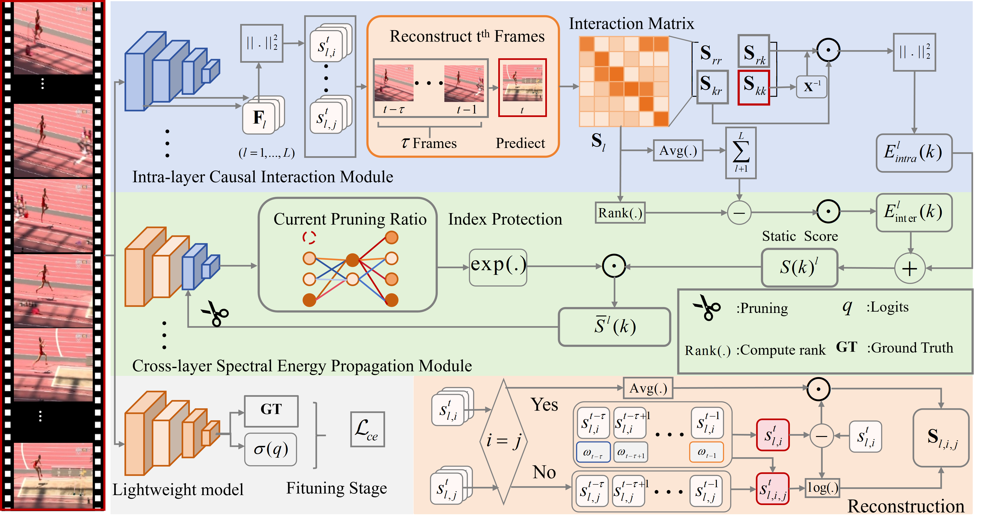
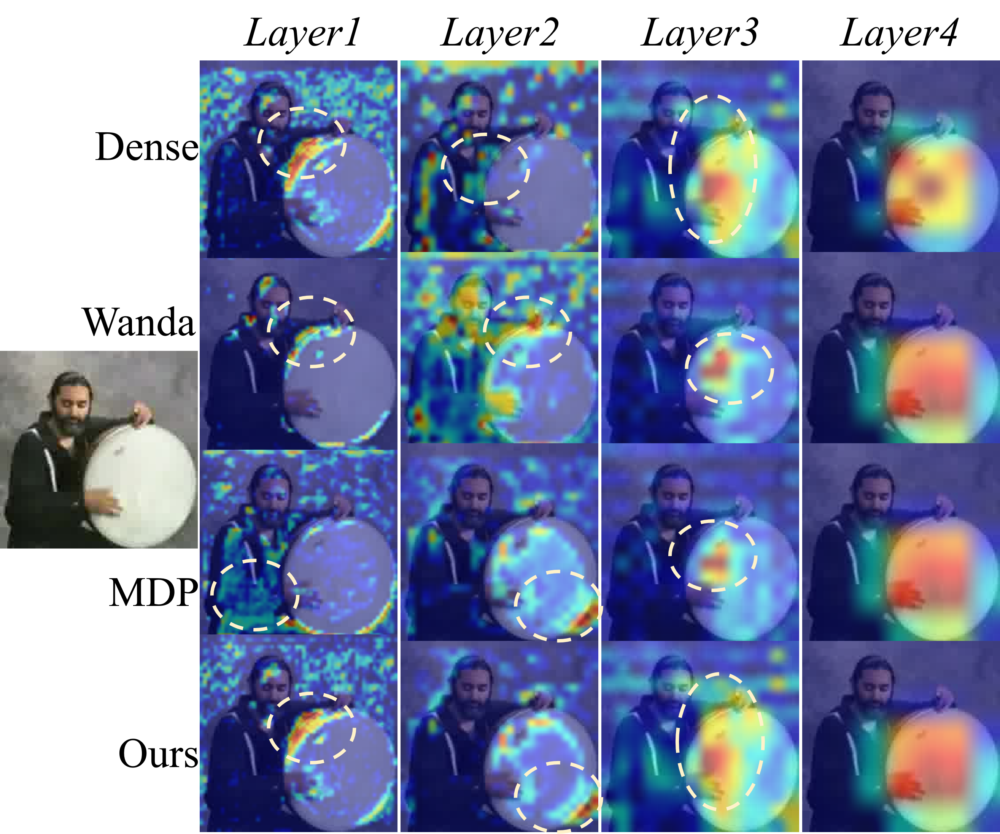

# Temporal Interaction and Perturbation Propagation for Video Model Pruning
[](https://www.python.org/)  [](https://pytorch.org/) 


## Abstract
Video action recognition models are characterized by massive parameter scales and high computational costs, which pose significant challenges for their deployment on edge devices. Although pruning techniques for image models model local relations among units within the single layer, which fails to capture dynamic weight correlations, leading to inaccurate importance estimation of pruning units(e.g., attention heads or tokens). Furthermore, there exists the problem that the weight redundancy pruning may amplify perturbation,due to then on-linear
mappings across several shallow layers. To address these issues, we present a global pruning method named Temporal Interaction and Perturbation Propagation (TIPP). Specifically, we develop the intra-layer temporal interaction module, which employs Granger causality to quantify dynamic functional coupling among pruning units and derives a layer weight compensation mechanism via the Schur complement. This helps to better estimate importance of pruniing units. Meanwhile, we design the inter-layer global perturbation propagation module, which models the evolution of perturbation strength using the spectral radius of the jacobian matrix. This encourages an adaptive adjustment of pruning ratio for each layer with a survival factor. Extensive experiments on three video benchmarks (UCF101, Kinetics-400, and Sth-Sth-v2) and two image benchmarks (CIFAR100 and ImageNet) demonstrate the superiority of the proposed method over existing state-of-the-art alternatives.

<p align="center">

</p>

## Table of Contents
- [Installation](#installation) 
- [Dataset Requirements](#dataset-requirements)
- [Training-Test](#training-test)
- [Qualitative Results](#qualitative-results)
- [Citation](#citation)
- [Contact](#contact)
- [Acknowledgement](#acknowledgement)
- [License](#license)


## Installation

The code was tested on a Conda environment installed on Ubuntu 18.04.

Install [Conda](https://docs.conda.io/en/latest/miniconda.html) and then create an environment as follows:
- Python 3.8.19 :

```
conda create -n tipp python=3.8.19 
```

```
conda activate tipp
```
- Pytorch 1.7
- CUDA 10.1

```
conda install pytorch==1.7.0 torchvision==0.8.0 torchaudio==0.7.0 cudatoolkit=10.1 -c pytorch
```

## Dataset Requirements

### UCF101

Follow the instructions [here](https://www.crcv.ucf.edu/data/UCF101/UCF101.rar) to download the dataset.

Then, extract and organize the files inside your cloned repo directory as follows (note that only the necessary files are shown):

```text
TIPP/
└── UCF101/
  │   ├── videoset.csv  (videos metadata file)
  │   ├── Videos/
  │   │   └── *.avi    (video files)
  │   └── text_annotations/
  │       ├── ucf101_annotation.txt (actual text annotations)
```


## Training-Test
First, download the pretrained weights of Slowfast16*8 from this [link]( https://pan.baidu.com/s/1BaHUfbQt48q20sqhQWtmFQ）code: sszt. Place the downloaded file inside your cloned repo directory as `checkpoint/slowfast-teacher-ucf101.ckpt`.

Next, run `python tippslowfast.py ` to train the model in the paper.

## Quantitative results on UCF101.

| Pruning Method | Method | Acc(TOP-1) | Acc(TOP-5 )|Params
| :----: |:----: | :--: | :---------: | :---------: |
|  Dense Model |Slowfast| 90.23|    97.22    |62.14| 
|  TIPP |Slowfast| 85.18|    95.10    | 31.07|

## Qualitative results 


<p align="center">
     <br>
</p>

Qualitative comparison between the baseline and our pruning method on UCF101
## Citation

```
@inproceedings{--tipp, 
  author    = {},
  title     = {Temporal Interaction and Perturbation Propagation for Video Model Pruning},
booktitle   = {},
  pages     = {},
  year      = {}
}
```

## Contact
If you have any questions, please feel free to contact Mr. Chenhao Ping via email([pch@hdu.edu.cn](mailto:pch@hdu.edu.cn)). 

## Acknowledgement
We would like to thank the authors of [TT] (https://github.com/zhipeng-wei/TT), which has significantly accelerated the development of our tipp Method.

## License
This project is licensed under the MIT License. See the [LICENSE file](https://github.com/A4Bio/E3-CryoFold/blob/main/LICENSE) for details.